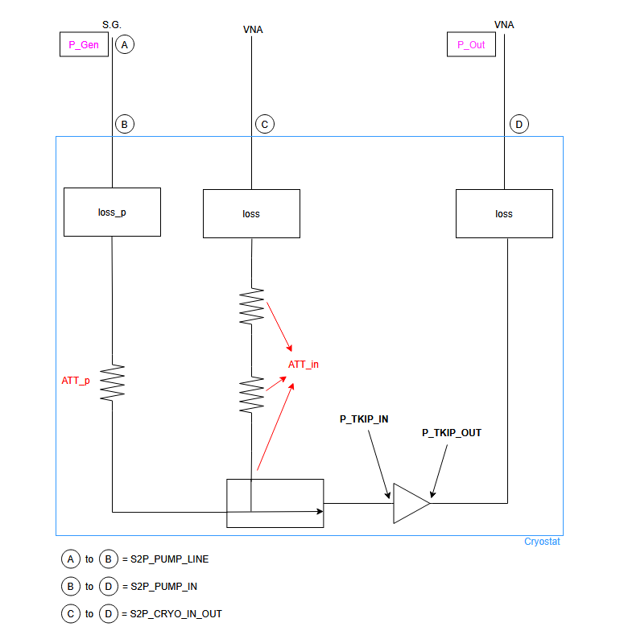

# thirdHarmonic_automated

## What it does
These files are used to calculate the power at the input and output of a TKIP while measuring the generation of harmonics in it. The calculations are still to be verified and different approaches are being tested at the moment. To be updated.

## How to run
The script harmonic_measurement.py performs measurements using a signal generator and a VNA under Test Receiver mode (reading of signals with no output power from other ports of the VNA).
It will save csv files around the measured tones, to be used for further analysis.

The script harmonic_analysis_corrections_threeS2P.py is the current version of the analysis script. It plots the maximum power of all the saved csv files grouped by frequency from the signal generator tone and respective harmonic.
Corrections to the values the instruments read to generate the input tone and reading the power at the output are performed following the schematic ahead:



Then the values to be plotted are:
```
loss(f) = 0.5 * [S2P_CRYO_IN_OUT(f) - ATT_in] 
P_TKIP_IN = P_GEN + S2P_PUMP_LINE(f) + S2P_PUMP_IN(f) + 0.5*ATT_in - 0.5*S2P_CRYO_IN_OUT(f)
P_TKIP_OUT = P_out - loss(f*h)
```

## Requirements
- A VNA...
- Signal generator
- A non-linear device to measure a non-linear output response.

## Example
The measurement and analysis scripts will write and read, respectively, the data in the same way.
For example, we can study measurements at 2, 3, 4 and 5 GHz with input powers described in `power_list` and measuring the fundamental tone and third harmonic. Output files will be saved in `SAVE_DIR` with a prefix `FILE_PREFIX`
```
frequency_list = [2, 3, 4, 5]            # GHz — fundamental tone frequencies
power_list     = np.linspace(15, 25, 51).tolist()  # dBm — signal generator output powers
harmonic_list  = [1, 3]            # harmonic index (multiplier of fundamental)

SAVE_DIR      = pathlib.Path(r"C:\data\Camilo\Wafer UVA microstrip\microstrip E\harmonicsAutomated\microstripE_2345GHz_3rdH_10mK_fineStep")
FILE_PREFIX   = "harmAuto"
```

## Notes
The power correction at the moment is not exact - it works under many assumptions. Eventually it will be fixed and documented here.
